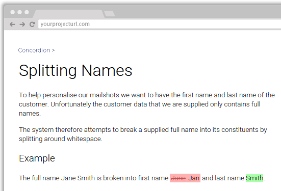

# BDD
## Behaviour Driven Development Tutorial

### Introducing Concordion
[Concordion](http://www.concordion.org) is a framework, primarily for Java and C#, which attempts to bridge the gap between the purist Given, When, Then syntax which ensures clarity and ease of testing, with more freedom to express complex ideas and more readable documentation.

Using the example from the Concordion homepage, you can see that the output is far more visually attractive and along with it intuitive, showing inline and with colour what our expected outcome and actual result of running our code was.




#### Adding Concordion

To use Concordion in our project, we will need to add the dependencies to our build. Open the pom.xml and add the following dependency.

```xml
<dependency>
	<groupId>org.concordion</groupId>
   <artifactId>concordion</artifactId>
   <version>2.2.0</version>
   <scope>test</scope>
</dependency>
```

Now, create a new directory in our test package called bdd.training.concordion and create a new text file called CalculatorTests.md. This is a markdown file, which is basically a text file, but when opened with the right tool will provide a rendered version, like a simplified HTML. In fact this page you're reading now is written in markdown. 

Let's add the following to the new file.

```
**Scenario**: when a user inputs two numbers into a calculator using the 'plus' method it should return the sum of the two numbers

**Given** a calculator

**When** the user adds the numbers 24 and 11 together
 
**Then** the value of the calculator must be 35
```

There isn't much difference between the text above and the one we had for the JBehave story file, but when you open it you will see it renders, you can look at the file directly in Github [here](https://github.com/MrCodeghost/BDD/edit/section4/tutorial/src/test/java/bdd/training/concordion/CalculatorTests.md) to see what I mean. 
